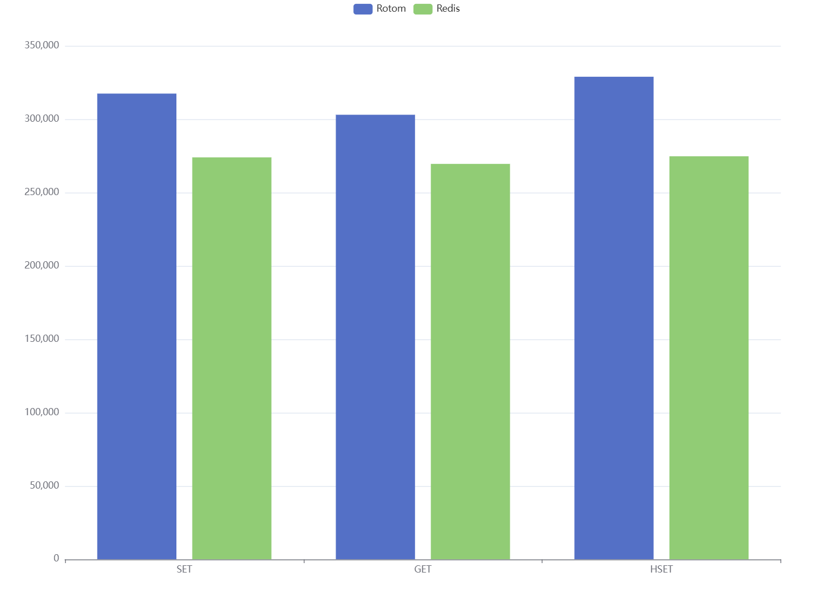

# Rotom

[](https://goreportcard.com/report/github.com/xgzlucario/rotom) [](https://pkg.go.dev/github.com/xgzlucario/rotom)   [](https://codecov.io/gh/xgzlucario/rotom) [](https://github.com/xgzlucario/rotom/actions/workflows/rotom.yml)

## 介绍

这里是 rotom，一个使用 Go 编写的 tiny Redis Server。基于 IO 多路复用技术，还原了 Redis 中的 AeLoop 核心事件循环机制。

rotom 基于 [godis](https://github.com/archeryue/godis) 项目

### 实现特性

1. 使用 unix 网络编程实现的基于 epoll 的 AeLoop 事件循环
2. 兼容 Redis RESP 协议，你可以使用任何 redis 客户端连接 rotom
3. DB hashmap 基于 [GigaCache](https://github.com/xgzlucario/GigaCache)
4. AOF 支持
5. 目前支持命令 `set`, `get`, `hset`, `hget`, `hdel`, `lpush`, `rpush`, `lpop`, `rpop`, `lrange`

### 原理介绍

**IO 多路复用**

IO多路复用是一种同时监听多个 socket 的技术，当一个或多个 socket 的读或写操作就绪时，程序会得到就绪事件通知，并进行相应的读写操作。常用的 IO多路复用机制有 select, poll, kqueue 等，在 Linux 平台上使用的是 epoll。

**AeLoop 事件循环**

AeLoop(Async Event Loop) 是 Redis 的核心异步事件驱动机制，主要有以下步骤：

1. 文件事件（FileEvent）：使用 IO 多路复用处理网络 socket 上的读写事件。事件类型分为 `AE_READABLE` 和 `AE_WRIABLE`
2. 时间事件（TimeEvent）：处理需要延迟执行或定时执行的任务，如每隔 `100ms` 进行过期淘汰
3. 当事件就绪时，通过该事件绑定的回调函数进行处理

在 rotom 内部实现中，还原了 Redis 中的 AeLoop 事件循环机制，具体来说：

1. 当一个新的 tcp 连接到达时，通过 `AcceptHandler` 获取该 socket 连接的 fd，并添加至事件循环，注册 `AE_READABLE` 读事件
2. 读事件就绪时，通过 `ReadQueryFromClient` 将数据读出至 `queryBuf`
3. 通过 `ProcessQueryBuf` 从 `queryBuf` 中解析并执行对应命令
4. 保存命令执行结果，并注册 socket fd 的 `AE_WRIABLE` 写事件
5. 写事件就绪时，通过 `SendReplyToClient` 将所有结果写回客户端，一个写事件可能一次性写回多个读事件的结果
6. 资源释放，并不断循环上述过程，直到服务关闭

## 使用

**本机运行**

首先克隆项目到本地：

```bash
git clone https://github.com/xgzlucario/rotom
```

确保本地 golang 环境 `>= 1.22`，在项目目录下执行 `go run .` 启动服务，默认监听 `6379` 端口：

```
$ go run .
2024/06/05 15:26:47 cmd arguments: config=config.json, debug=false
2024/06/05 15:26:47 read config file: {
    "port": 6379,
    "appendonly": false,
    "appendfilename": "appendonly.aof"
}
2024/06/05 15:26:47 rotom server is ready to accept.
```

**容器运行**

或者你也可以使用容器运行，首先运行 `make build-docker` 打包：

```
REPOSITORY       TAG           IMAGE ID       CREATED         SIZE
rotom            latest        22f42ce9ae0e   8 seconds ago   18.4MB
```

然后启动容器：

```bash
docker run --rm -p 6379:6379 --name rotom rotom:latest
```

## Benchmark

测试将在同一台机器上运行 rotom，关闭 `appendonly`，并使用官方 `redis-benchmark` 工具测试不同命令的耗时。

```
goos: linux
goarch: amd64
pkg: github.com/xgzlucario/rotom
cpu: 13th Gen Intel(R) Core(TM) i5-13600KF
```



ROTOM SET

```bash
====== SET ======
  100000 requests completed in 0.31 seconds
  50 parallel clients
  3 bytes payload
  keep alive: 1
  multi-thread: no

Latency by percentile distribution:
0.000% <= 0.039 milliseconds (cumulative count 1)
50.000% <= 0.087 milliseconds (cumulative count 66525)
75.000% <= 0.095 milliseconds (cumulative count 81798)
87.500% <= 0.103 milliseconds (cumulative count 87619)
93.750% <= 0.119 milliseconds (cumulative count 94105)
96.875% <= 0.151 milliseconds (cumulative count 96975)
98.438% <= 0.215 milliseconds (cumulative count 98491)
99.219% <= 0.295 milliseconds (cumulative count 99241)
99.609% <= 0.407 milliseconds (cumulative count 99625)
99.805% <= 0.599 milliseconds (cumulative count 99827)
99.902% <= 0.791 milliseconds (cumulative count 99906)
99.951% <= 0.935 milliseconds (cumulative count 99962)
99.976% <= 1.439 milliseconds (cumulative count 99976)
99.988% <= 1.455 milliseconds (cumulative count 99994)
99.997% <= 1.463 milliseconds (cumulative count 99999)
99.999% <= 1.471 milliseconds (cumulative count 100000)
100.000% <= 1.471 milliseconds (cumulative count 100000)

Cumulative distribution of latencies:
87.619% <= 0.103 milliseconds (cumulative count 87619)
98.423% <= 0.207 milliseconds (cumulative count 98423)
99.267% <= 0.303 milliseconds (cumulative count 99267)
99.625% <= 0.407 milliseconds (cumulative count 99625)
99.761% <= 0.503 milliseconds (cumulative count 99761)
99.827% <= 0.607 milliseconds (cumulative count 99827)
99.856% <= 0.703 milliseconds (cumulative count 99856)
99.934% <= 0.807 milliseconds (cumulative count 99934)
99.962% <= 1.007 milliseconds (cumulative count 99962)
100.000% <= 1.503 milliseconds (cumulative count 100000)

Summary:
  throughput summary: 317460.31 requests per second
  latency summary (msec):
          avg       min       p50       p95       p99       max
        0.094     0.032     0.087     0.127     0.263     1.471
```

ROTOM GET

```bash
====== GET ======
  100000 requests completed in 0.33 seconds
  50 parallel clients
  3 bytes payload
  keep alive: 1
  multi-thread: no

Latency by percentile distribution:
0.000% <= 0.039 milliseconds (cumulative count 5)
50.000% <= 0.087 milliseconds (cumulative count 58882)
75.000% <= 0.095 milliseconds (cumulative count 88023)
93.750% <= 0.111 milliseconds (cumulative count 93816)
96.875% <= 0.151 milliseconds (cumulative count 97137)
98.438% <= 0.199 milliseconds (cumulative count 98621)
99.219% <= 0.255 milliseconds (cumulative count 99325)
99.609% <= 0.295 milliseconds (cumulative count 99616)
99.805% <= 0.391 milliseconds (cumulative count 99807)
99.902% <= 0.535 milliseconds (cumulative count 99917)
99.951% <= 0.991 milliseconds (cumulative count 99953)
99.976% <= 1.023 milliseconds (cumulative count 99978)
99.988% <= 1.039 milliseconds (cumulative count 99996)
99.997% <= 1.047 milliseconds (cumulative count 100000)
100.000% <= 1.047 milliseconds (cumulative count 100000)

Cumulative distribution of latencies:
91.824% <= 0.103 milliseconds (cumulative count 91824)
98.738% <= 0.207 milliseconds (cumulative count 98738)
99.632% <= 0.303 milliseconds (cumulative count 99632)
99.825% <= 0.407 milliseconds (cumulative count 99825)
99.873% <= 0.503 milliseconds (cumulative count 99873)
99.919% <= 0.607 milliseconds (cumulative count 99919)
99.920% <= 0.703 milliseconds (cumulative count 99920)
99.921% <= 0.807 milliseconds (cumulative count 99921)
99.947% <= 0.903 milliseconds (cumulative count 99947)
99.975% <= 1.007 milliseconds (cumulative count 99975)
100.000% <= 1.103 milliseconds (cumulative count 100000)

Summary:
  throughput summary: 303030.28 requests per second
  latency summary (msec):
          avg       min       p50       p95       p99       max
        0.090     0.032     0.087     0.119     0.223     1.047
```

ROTOM HSET

```bash
====== HSET ======
  100000 requests completed in 0.30 seconds
  50 parallel clients
  3 bytes payload
  keep alive: 1
  multi-thread: no

Latency by percentile distribution:
0.000% <= 0.031 milliseconds (cumulative count 2)
50.000% <= 0.079 milliseconds (cumulative count 65935)
75.000% <= 0.087 milliseconds (cumulative count 82455)
87.500% <= 0.095 milliseconds (cumulative count 89086)
93.750% <= 0.111 milliseconds (cumulative count 94258)
96.875% <= 0.135 milliseconds (cumulative count 97222)
98.438% <= 0.167 milliseconds (cumulative count 98445)
99.219% <= 0.215 milliseconds (cumulative count 99257)
99.609% <= 0.351 milliseconds (cumulative count 99616)
99.805% <= 0.575 milliseconds (cumulative count 99812)
99.902% <= 0.671 milliseconds (cumulative count 99903)
99.951% <= 0.855 milliseconds (cumulative count 99958)
99.976% <= 0.887 milliseconds (cumulative count 99989)
99.994% <= 0.951 milliseconds (cumulative count 99996)
99.997% <= 0.959 milliseconds (cumulative count 100000)
100.000% <= 0.959 milliseconds (cumulative count 100000)

Cumulative distribution of latencies:
92.230% <= 0.103 milliseconds (cumulative count 92230)
99.152% <= 0.207 milliseconds (cumulative count 99152)
99.525% <= 0.303 milliseconds (cumulative count 99525)
99.729% <= 0.407 milliseconds (cumulative count 99729)
99.781% <= 0.503 milliseconds (cumulative count 99781)
99.863% <= 0.607 milliseconds (cumulative count 99863)
99.918% <= 0.703 milliseconds (cumulative count 99918)
99.990% <= 0.903 milliseconds (cumulative count 99990)
100.000% <= 1.007 milliseconds (cumulative count 100000)

Summary:
  throughput summary: 328947.38 requests per second
  latency summary (msec):
          avg       min       p50       p95       p99       max
        0.085     0.024     0.079     0.119     0.199     0.959
```

REDIS SET

```bash
====== SET ======
  100000 requests completed in 0.37 seconds
  50 parallel clients
  3 bytes payload
  keep alive: 1
  host configuration "save": 3600 1 300 100 60 10000
  host configuration "appendonly": no
  multi-thread: no

Latency by percentile distribution:
0.000% <= 0.031 milliseconds (cumulative count 2)
50.000% <= 0.095 milliseconds (cumulative count 66242)
75.000% <= 0.103 milliseconds (cumulative count 86834)
87.500% <= 0.111 milliseconds (cumulative count 94421)
96.875% <= 0.127 milliseconds (cumulative count 97184)
98.438% <= 0.159 milliseconds (cumulative count 98449)
99.219% <= 0.207 milliseconds (cumulative count 99221)
99.609% <= 0.311 milliseconds (cumulative count 99640)
99.805% <= 0.519 milliseconds (cumulative count 99830)
99.902% <= 0.727 milliseconds (cumulative count 99909)
99.951% <= 0.839 milliseconds (cumulative count 99953)
99.976% <= 0.983 milliseconds (cumulative count 99998)
99.998% <= 0.991 milliseconds (cumulative count 99999)
99.999% <= 0.999 milliseconds (cumulative count 100000)
100.000% <= 0.999 milliseconds (cumulative count 100000)

Cumulative distribution of latencies:
86.834% <= 0.103 milliseconds (cumulative count 86834)
99.221% <= 0.207 milliseconds (cumulative count 99221)
99.609% <= 0.303 milliseconds (cumulative count 99609)
99.727% <= 0.407 milliseconds (cumulative count 99727)
99.763% <= 0.503 milliseconds (cumulative count 99763)
99.841% <= 0.607 milliseconds (cumulative count 99841)
99.891% <= 0.703 milliseconds (cumulative count 99891)
99.941% <= 0.807 milliseconds (cumulative count 99941)
99.969% <= 0.903 milliseconds (cumulative count 99969)
100.000% <= 1.007 milliseconds (cumulative count 100000)

Summary:
  throughput summary: 273972.59 requests per second
  latency summary (msec):
          avg       min       p50       p95       p99       max
        0.096     0.024     0.095     0.119     0.191     0.999
```

REDIS GET

```bash
====== GET ======
  100000 requests completed in 0.37 seconds
  50 parallel clients
  3 bytes payload
  keep alive: 1
  host configuration "save": 3600 1 300 100 60 10000
  host configuration "appendonly": no
  multi-thread: no

Latency by percentile distribution:
0.000% <= 0.039 milliseconds (cumulative count 7)
50.000% <= 0.095 milliseconds (cumulative count 57828)
75.000% <= 0.103 milliseconds (cumulative count 82527)
87.500% <= 0.111 milliseconds (cumulative count 93180)
93.750% <= 0.119 milliseconds (cumulative count 96200)
96.875% <= 0.127 milliseconds (cumulative count 97042)
98.438% <= 0.167 milliseconds (cumulative count 98596)
99.219% <= 0.199 milliseconds (cumulative count 99315)
99.609% <= 0.231 milliseconds (cumulative count 99673)
99.805% <= 0.295 milliseconds (cumulative count 99808)
99.902% <= 0.471 milliseconds (cumulative count 99903)
99.951% <= 0.527 milliseconds (cumulative count 99963)
99.976% <= 0.567 milliseconds (cumulative count 99977)
99.988% <= 0.703 milliseconds (cumulative count 99991)
99.994% <= 0.711 milliseconds (cumulative count 99996)
99.997% <= 0.719 milliseconds (cumulative count 100000)
100.000% <= 0.719 milliseconds (cumulative count 100000)

Cumulative distribution of latencies:
82.527% <= 0.103 milliseconds (cumulative count 82527)
99.451% <= 0.207 milliseconds (cumulative count 99451)
99.825% <= 0.303 milliseconds (cumulative count 99825)
99.890% <= 0.407 milliseconds (cumulative count 99890)
99.937% <= 0.503 milliseconds (cumulative count 99937)
99.980% <= 0.607 milliseconds (cumulative count 99980)
99.991% <= 0.703 milliseconds (cumulative count 99991)
100.000% <= 0.807 milliseconds (cumulative count 100000)

Summary:
  throughput summary: 269541.78 requests per second
  latency summary (msec):
          avg       min       p50       p95       p99       max
        0.097     0.032     0.095     0.119     0.191     0.719
```

REDIS HSET

```bash
====== HSET ======
  100000 requests completed in 0.36 seconds
  50 parallel clients
  3 bytes payload
  keep alive: 1
  host configuration "save": 3600 1 300 100 60 10000
  host configuration "appendonly": no
  multi-thread: no

Latency by percentile distribution:
0.000% <= 0.031 milliseconds (cumulative count 2)
50.000% <= 0.095 milliseconds (cumulative count 68152)
75.000% <= 0.103 milliseconds (cumulative count 87772)
93.750% <= 0.111 milliseconds (cumulative count 94344)
96.875% <= 0.135 milliseconds (cumulative count 97131)
98.438% <= 0.183 milliseconds (cumulative count 98442)
99.219% <= 0.255 milliseconds (cumulative count 99252)
99.609% <= 0.351 milliseconds (cumulative count 99626)
99.805% <= 0.519 milliseconds (cumulative count 99817)
99.902% <= 0.607 milliseconds (cumulative count 99903)
99.951% <= 1.311 milliseconds (cumulative count 99955)
99.976% <= 1.399 milliseconds (cumulative count 99977)
99.988% <= 1.455 milliseconds (cumulative count 99988)
99.994% <= 1.479 milliseconds (cumulative count 99995)
99.997% <= 1.495 milliseconds (cumulative count 99997)
99.998% <= 1.511 milliseconds (cumulative count 99999)
99.999% <= 1.527 milliseconds (cumulative count 100000)
100.000% <= 1.527 milliseconds (cumulative count 100000)

Cumulative distribution of latencies:
87.772% <= 0.103 milliseconds (cumulative count 87772)
98.811% <= 0.207 milliseconds (cumulative count 98811)
99.485% <= 0.303 milliseconds (cumulative count 99485)
99.681% <= 0.407 milliseconds (cumulative count 99681)
99.770% <= 0.503 milliseconds (cumulative count 99770)
99.903% <= 0.607 milliseconds (cumulative count 99903)
99.904% <= 0.703 milliseconds (cumulative count 99904)
99.931% <= 0.807 milliseconds (cumulative count 99931)
99.950% <= 1.207 milliseconds (cumulative count 99950)
99.951% <= 1.303 milliseconds (cumulative count 99951)
99.979% <= 1.407 milliseconds (cumulative count 99979)
99.997% <= 1.503 milliseconds (cumulative count 99997)
100.000% <= 1.607 milliseconds (cumulative count 100000)

Summary:
  throughput summary: 274725.28 requests per second
  latency summary (msec):
          avg       min       p50       p95       p99       max
        0.096     0.024     0.095     0.119     0.223     1.527
```