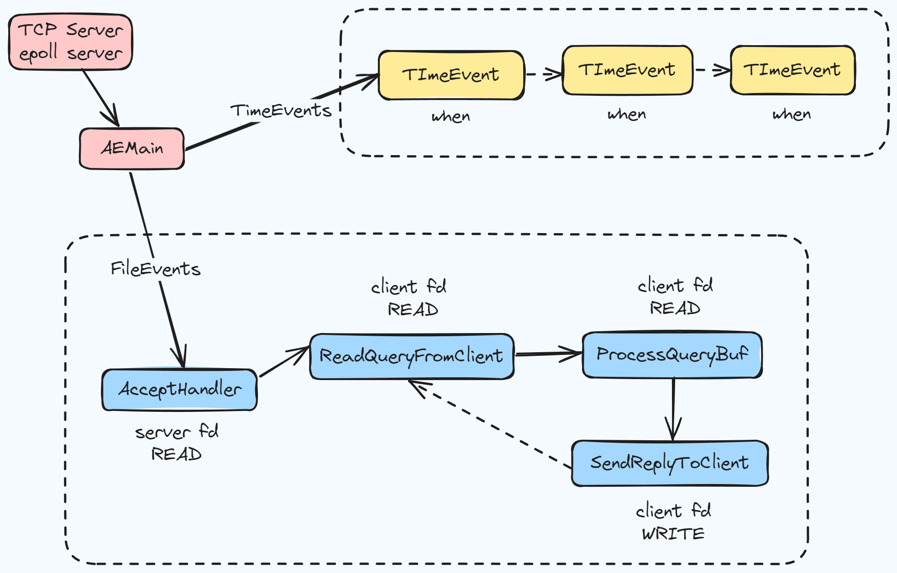
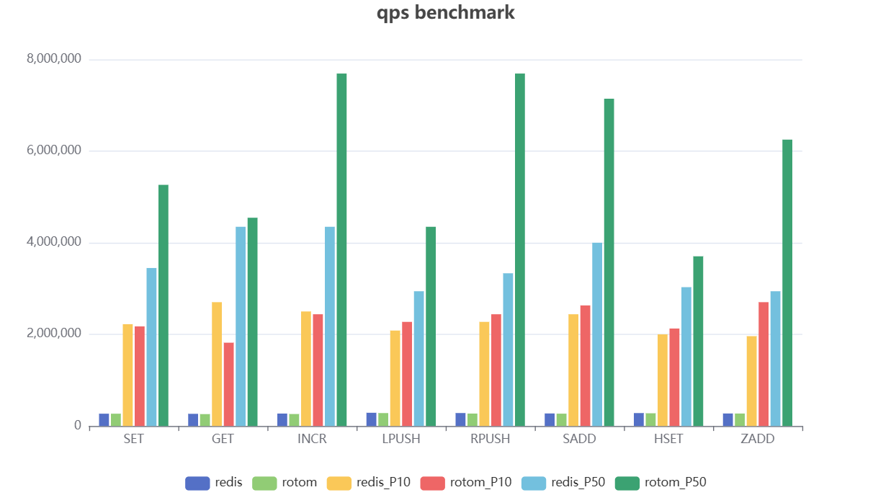

# Rotom

[](https://goreportcard.com/report/github.com/xgzlucario/rotom) [](https://pkg.go.dev/github.com/xgzlucario/rotom)  [](https://codecov.io/gh/xgzlucario/rotom) [](https://github.com/xgzlucario/rotom/actions/workflows/rotom.yml) [](https://github.com/avelino/awesome-go)

中文 | [English](README.md)

## 介绍

这里是 rotom，一个使用 Go 编写的高性能，低延迟的 tiny Redis Server。基于 IO 多路复用还原了 Redis 中的 AeLoop 核心事件循环机制。

## 特性

- 基于 epoll 网络模型，还原了 Redis 中的 AeLoop 单线程事件循环
- 非常好的优化，达到原生 Redis 的性能
- 兼容 Redis RESP 协议，可以使用任何 redis 客户端连接
- 实现了 String, Hash, Set, List, ZSet 数据结构
- RDB 和 AOF 持久化支持 
- 支持 20 多种常用命令

## AELoop 事件循环

AeLoop(Async Event Loop) 是 Redis 的核心异步事件驱动机制，主要有以下部分：



1. FileEvent：使用 IO 多路复用处理网络 socket 上的读写事件。事件分为 `READABLE` 和 `WRITABLE`
2. TimeEvent：处理需要延迟执行或定时执行的任务，如每隔 `100ms` 进行过期淘汰
3. 当事件就绪时，通过该事件绑定的回调函数进行处理

在 rotom 内部实现中，还原了 Redis 中的 AeLoop 事件循环机制，具体来说：

1. 当一个新的 tcp 连接到达时，通过 `AcceptHandler` 获取连接的 socket fd，并添加至事件循环，注册读事件
2. 读事件就绪时，通过 `ReadQueryFromClient` 将缓冲数据读出至 `queryBuf`
3. 通过 `ProcessQueryBuf` 从 `queryBuf` 中解析并执行对应命令
4. 保存命令执行结果，并注册 socket fd 的写事件
5. 写事件就绪时，通过 `SendReplyToClient` 将所有结果写回客户端，一个写事件可能一次性写回多个读事件的结果
6. 资源释放，并不断循环上述过程，直到服务关闭

## 数据结构

rotom 在数据结构上做了许多优化：

- dict：rotom 使用 `stdmap` 作为 db 的哈希表，自带渐进式 rehash 功能
- hash：基于 `zipmap`，拥有更高的内存效率 
- set：当 set 较小时使用 `zipset`，较大时使用 `mapset`
- list：使用基于 `listpack` 的双向链表 `quicklist`
- zset：当 zset 较小时使用 `zipzset`，较大时使用 `hash` + `skiplist`

值得一提的是，`zipmap` 和 `zipset` 是空间紧凑的数据结构，它们都基于 `listpack`, 这是 Redis 提出的替代 `ziplist` 的新型压缩列表，支持正序及逆序遍历，解决了 `ziplist` 存在级联更新的问题。

## 性能



测试将在同一台机器上，关闭 `appendonly`，并使用 `redis-benchmark` 工具测试不同命令的 qps。

```
goos: linux
goarch: amd64
pkg: github.com/xgzlucario/rotom
cpu: 13th Gen Intel(R) Core(TM) i5-13600KF
```

## 计划

- LRU 缓存及内存淘汰支持
- dict 渐进式哈希支持
- RDB 及 AOF Rewrite 支持
- 兼容更多常用命令

## 使用

**本机运行**

首先克隆项目到本地：

```bash
git clone https://github.com/xgzlucario/rotom
```

确保本地 golang 环境 `>= 1.22`，在项目目录下执行 `go run .` 启动服务，默认监听 `6379` 端口：

```
$ go run .
2024-07-18 23:37:13 DBG 
 ________      _____                  
 ___  __ \_______  /_____________ ___   Rotom 64 bit (amd64/linux)
 __  /_/ /  __ \  __/  __ \_  __ '__ \  Port: 6379, Pid: 15817
 _  _, _// /_/ / /_ / /_/ /  / / / / /  Build: 
 /_/ |_| \____/\__/ \____//_/ /_/ /_/

2024-07-18 23:37:13 INF read config file config=config.json
2024-07-18 23:37:13 INF rotom server is ready to accept.
```

**容器运行**

或者你也可以使用容器运行，首先运行 `make build-docker` 打包：

```
REPOSITORY       TAG           IMAGE ID       CREATED         SIZE
rotom            latest        e93cf2060e5f   13 seconds ago  40.2MB
```

然后启动容器：

```bash
docker run --rm -p 6379:6379 --name rotom rotom:latest
```