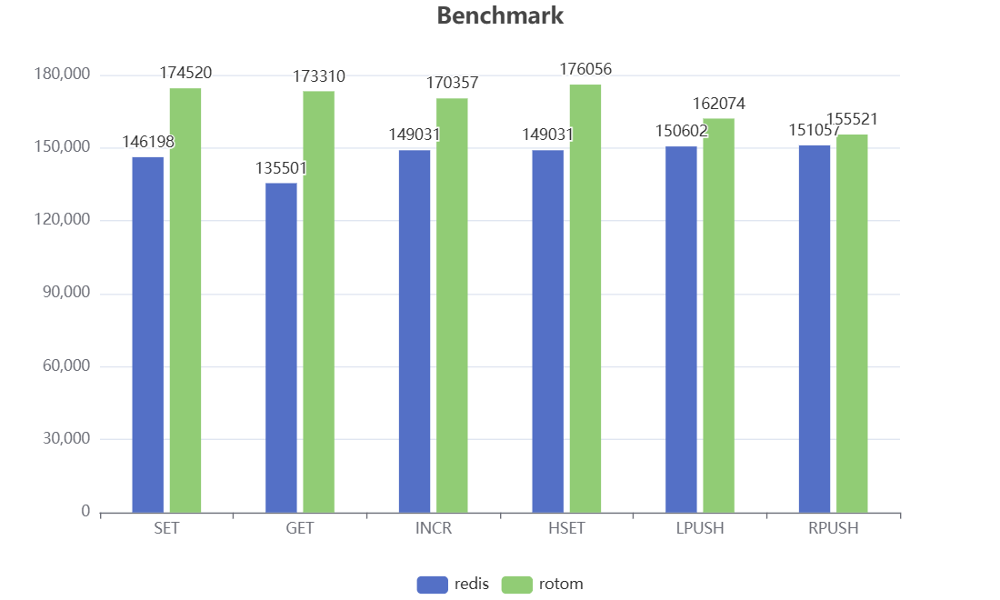

# Rotom

[](https://goreportcard.com/report/github.com/xgzlucario/rotom) [](https://pkg.go.dev/github.com/xgzlucario/rotom)  [](https://codecov.io/gh/xgzlucario/rotom) [](https://github.com/xgzlucario/rotom/actions/workflows/rotom.yml) [](https://github.com/avelino/awesome-go)

中文 | [English](README.md)

## 介绍

这里是 rotom，一个使用 Go 编写的高性能，低延迟的 tiny Redis Server。基于 IO 多路复用还原了 Redis 中的 AeLoop 核心事件循环机制。

## 特性

1. 基于 epoll 网络模型，还原了 Redis 中的 AeLoop 单线程事件循环
2. 兼容 Redis RESP 协议，你可以使用任何 redis 客户端连接 rotom
3. 实现了 dict, list, map, zipmap, set, zipset, zset 数据结构
4. AOF 支持
5. 支持 20 多种常用命令
6. 支持执行 lua 脚本

## AELoop 事件循环

AeLoop(Async Event Loop) 是 Redis 的核心异步事件驱动机制，主要有以下部分：

1. FileEvent：使用 IO 多路复用处理网络 socket 上的读写事件。事件分为 `READABLE` 和 `WRIABLE`
2. TimeEvent：处理需要延迟执行或定时执行的任务，如每隔 `100ms` 进行过期淘汰
3. 当事件就绪时，通过该事件绑定的回调函数进行处理

在 rotom 内部实现中，还原了 Redis 中的 AeLoop 事件循环机制，具体来说：

1. 当一个新的 tcp 连接到达时，通过 `AcceptHandler` 获取连接的 socket fd，并添加至事件循环，注册读事件
2. 读事件就绪时，通过 `ReadQueryFromClient` 将缓冲数据读出至 `queryBuf`
3. 通过 `ProcessQueryBuf` 从 `queryBuf` 中解析并执行对应命令
4. 保存命令执行结果，并注册 socket fd 的写事件
5. 写事件就绪时，通过 `SendReplyToClient` 将所有结果写回客户端，一个写事件可能一次性写回多个读事件的结果
6. 资源释放，并不断循环上述过程，直到服务关闭

## 数据结构

rotom 在数据结构上做了许多优化：

- dict：rotom 使用 `swissmap` 作为 db 的哈希表，它的性能和内存使用效率都比 `stdmap` 更好
- hash：当 hash 较小时使用 `zipmap`，较大时使用 `hashmap`
- set：当 set 较小时使用 `zipset`，较大时使用 `mapset`
- list：使用基于 `listpack` 的双向链表 `quicklist`
- zset：基于 `hashmap` + `rbtree`

值得一提的是，`zipmap` 和 `zipset` 是空间紧凑的数据结构，它们都基于 `listpack`, 这是 Redis 提出的替代 `ziplist` 的新型压缩列表，支持正序及逆序遍历，解决了 `ziplist` 存在级联更新的问题。

## 性能



测试将在同一台机器上，关闭 `appendonly`，并使用 `redis-benchmark` 工具测试不同命令的 qps。

```
goos: linux
goarch: amd64
pkg: github.com/xgzlucario/rotom
cpu: 13th Gen Intel(R) Core(TM) i5-13600KF
```

```
	redis	rotom	redis_P10	rotom_P10	redis_P50	rotom_P50
SET	268817	268817	2222222	2173913	3448276	5263158
GET	265957	259740	2702702	1818181	4347826	4545454
INCR	271739	261780	2500000	2439024	4347826	7692307
LPUSH	289017	282485	2083333	2272727	2941176	4347826
RPUSH	283286	271739	2272727	2439024	3333333	7692307
SADD	273972	269541	2439024	2631579	4000000	7142857
HSET	282485	277777	2000000	2127659	3030303	3703703
ZADD	273224	272479	1960784	2702702	2941176	6249999
```

## 计划

- LRU 缓存及内存淘汰支持
- dict 渐进式哈希支持
- RDB 及 AOF Rewrite 支持
- 兼容更多常用命令

## 使用

**本机运行**

首先克隆项目到本地：

```bash
git clone https://github.com/xgzlucario/rotom
```

确保本地 golang 环境 `>= 1.22`，在项目目录下执行 `go run .` 启动服务，默认监听 `6379` 端口：

```
$ go run .
2024-07-18 23:37:13 DBG 
 ________      _____                  
 ___  __ \_______  /_____________ ___   Rotom 64 bit (amd64/linux)
 __  /_/ /  __ \  __/  __ \_  __ '__ \  Port: 6379, Pid: 15817
 _  _, _// /_/ / /_ / /_/ /  / / / / /  Build: 
 /_/ |_| \____/\__/ \____//_/ /_/ /_/

2024-07-18 23:37:13 INF read config file config=config.json
2024-07-18 23:37:13 INF rotom server is ready to accept.
```

**容器运行**

或者你也可以使用容器运行，首先运行 `make build-docker` 打包：

```
REPOSITORY       TAG           IMAGE ID       CREATED         SIZE
rotom            latest        22f42ce9ae0e   8 seconds ago   20.5MB
```

然后启动容器：

```bash
docker run --rm -p 6379:6379 --name rotom rotom:latest
```